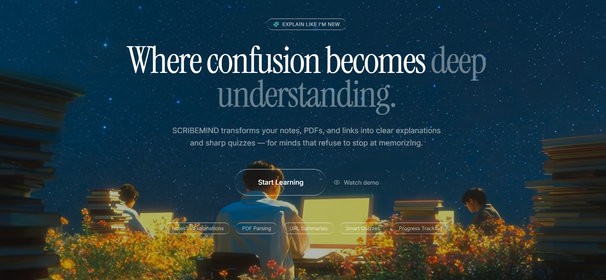
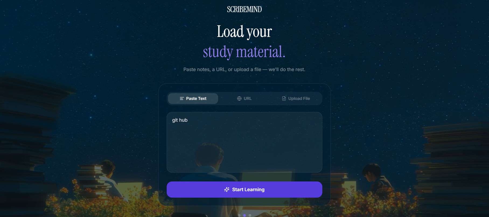
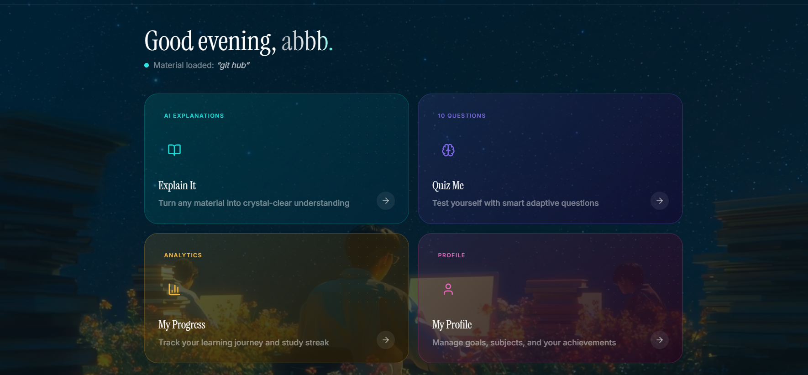
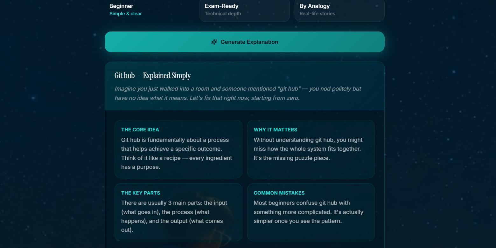
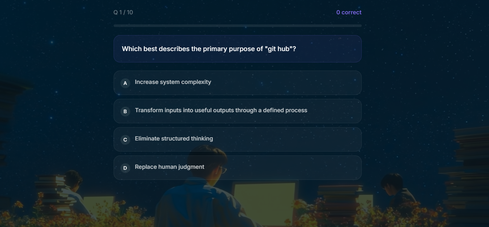
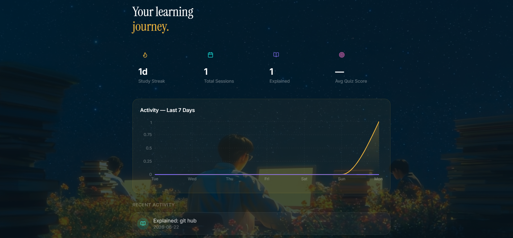

  # 🎓 ScribeMind Learning Platform-3D website

ScribeMind is an advanced, high-fidelity online education ecosystem built to bridge the gap between complex digital curriculum and engagement-first student workflows.

## 🚀 Key Architectural Strengths
- **Immersive UX Design:** Designed with a hyper-polished, premium, high-converting aesthetic built for modern scaling.
- **Production-Ready Component Architecture:** Engineered using modular and clean React patterns for flawless scalability.
- **Flawless Mobile Optimization:** Fully responsive breakpoint scaling from ultra-wide desktops down to mobile devices.
- **Lightning Performance:** Built on Vite for near-instant rendering speeds and optimized client-side performance.

## 🛠️ Technology Stack
- **Frontend Core:** React + Vite
- **Styling Architecture:** Tailwind CSS
- **Design System:** Primitive-based Custom Layout Components
## 🚀 Problem Statement

Students spend hours reading lengthy PDFs and often struggle to revise effectively.

SCRIBEMIND solves this problem by turning uploaded study materials into:

- 📑 Smart Notes
- 🧠 Flashcards
- ❓ Quizzes
- ⚡ Faster Revision

---

## ✨ Features

- 📂 Upload PDFs
- 📝 Generate concise notes
- 🧠 Create flashcards automatically
- ❓ AI-generated quizzes
- 📱 Responsive design
- ⚡ Fast and simple interface

---

## 📸 Screenshots

### 🏠 Home Page

---

### 📚 Study Hub

---

### 📊 Dashboard

---

### 🧠 Explain Studio

---

### ❓ Quiz Arena

---

### 📈 Learning Journey

---
  ## 🎥 Project Demo Video

Click the video player below to watch the live application walkthrough:

## DEMO VIDEO

https://github.com/user-attachments/assets/0dec3a39-4193-43d8-981c-195baf4b35e6